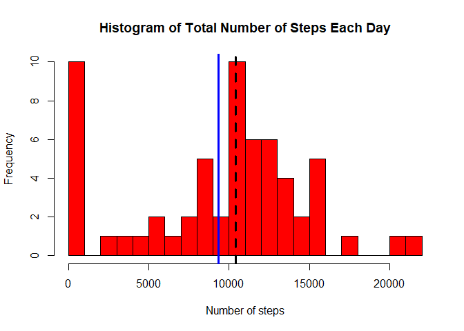
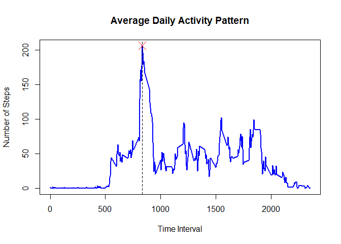
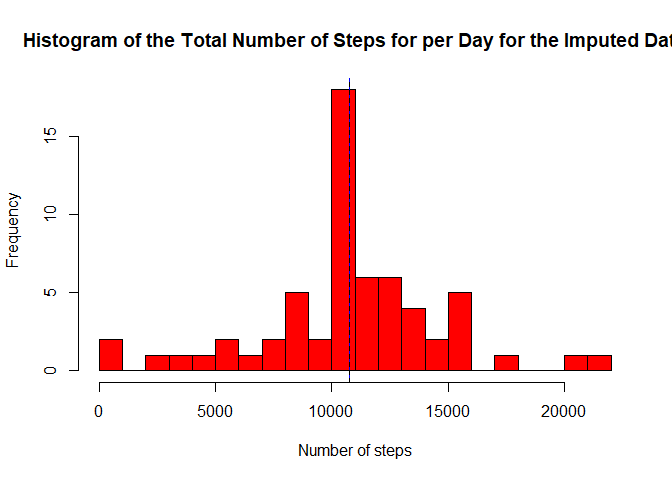
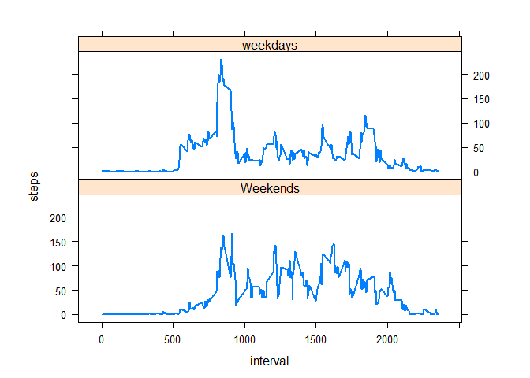

## Loading and preprocessing the data
The data is collected from activity monitoring devices such as a Fitbit, Nike Fuelband, or Jawbone Up. These type of devices are part of the “quantified self” movement – a group of enthusiasts who take measurements about themselves regularly to improve their health, to find patterns in their behavior, or because they are tech geeks.

The data can be downloaded from the link [here](https://d396qusza40orc.cloudfront.net/repdata%2Fdata%2Factivity.zip).


```r
activity <- read.csv("activity.csv")   #Reading the data
summary(activity)     #Summary of how the data looks like.
```

```
##      steps                date          interval     
##  Min.   :  0.00   2012-10-01:  288   Min.   :   0.0  
##  1st Qu.:  0.00   2012-10-02:  288   1st Qu.: 588.8  
##  Median :  0.00   2012-10-03:  288   Median :1177.5  
##  Mean   : 37.38   2012-10-04:  288   Mean   :1177.5  
##  3rd Qu.: 12.00   2012-10-05:  288   3rd Qu.:1766.2  
##  Max.   :806.00   2012-10-06:  288   Max.   :2355.0  
##  NA's   :2304     (Other)   :15840
```

The data consists of 17568 observations and has 3 variables which are the date of recording the data, the number of steps and the the interval in which the steps were recorded.


## What is mean total number of steps taken per day?

For calculating the mean number of steps taken per day, we first calculate the total number of steps taken each day.

```r
steps_total = vector()
activitysub <- activity[complete.cases(activity$steps),] #creating a subset of the whole data without NA values
days <- unique(activity$date)
for( i in 1:length(days)){
      steps_total[i] = sum(activitysub$steps[activitysub$date == days[i]],na.rm = T)
}
summary(steps_total)
```

```
##    Min. 1st Qu.  Median    Mean 3rd Qu.    Max. 
##       0    6778   10395    9354   12811   21194
```
Now, we plot a histogram for the total number of steps taken each day.

```r
hist(steps_total, breaks = 25, col = "red", xlab = "Number of steps", main = "Histogram of Total Number of Steps Each Day")
abline(v = median(steps_total), col = "black", lwd = 3, lty = 2)
abline(v = mean(steps_total), col = "blue", lwd = 3)
```

<!-- -->

```r
mean_steps <- mean(steps_total)   #Calculating the median total number of steps
median_steps <- median(steps_total)   #Calculating the mean total number of steps
```
The blue line in the graph represents the mean of the total number of steps each day and the blue line shows the black dotted line shows the median.

The median is 10395 steps and the mean is 9354.2295082 steps.

## What is the average daily activity pattern?
To calculate the average daily activity pattern, we need to calculate the average number of steps taken in a particular interval for all the days. we do that by taking all the unique values of interval and then averaging the number of steps for each such interval. The result is stored in the avg_steps_interval object.

```r
avg_steps_interval = vector()
for( i in 1:length(unique(activity$interval))){
      avg_steps_interval[i] = mean(activity$steps[activity$interval == unique(activity$interval)[i]],na.rm = T)
}
```
Now, we plot the line plot of average activity versus the time interval, and find out the time interval in which contains maximum number of steps.

```r
plot(unique(activity$interval),avg_steps_interval, type = "l",lwd = 2,col = "blue",
     xlab ="Time Interval", ylab = "Number of Steps", main = "Average Daily Activity Pattern")
abline(v = unique(activity$interval)[which.max(avg_steps_interval)], lty = 2)
points(x = unique(activity$interval)[which.max(avg_steps_interval)], y = avg_steps_interval[which.max(avg_steps_interval)], pch = 4, col = "red", cex = 2 )
```

<!-- -->

```r
peak_steps <- avg_steps_interval[which.max(avg_steps_interval)]
```
The point marks the peak average daily activity and the dotted line shows the interval in which the activity takes place.

The interval in which peak activity takes place is 835 to 890 which is around 1:55 pm to 2 pm in the evening and the average number of steps in the interval are 206.1698113.


## Imputing missing values

Data collection is a tough process and leads to certain amount of data to be empty or NA. Here, we first see the amount of data that is not available and then impute those values with the mean value in that particular interval.


```r
NA_sum <- sum(is.na(activity))
NA_percent <- NA_sum/nrow(activity)*100
act <- activity
d <- data.frame(interval = unique(activity$interval), mean_steps = avg_steps_interval)
```
Thus, our data set has 2304 NA values and that is around 13.1147541% of our total data set.
So, imputing the vales of NA seems to be an obvious choice for this data set.

For imputing the empty values of the data set, we take the mean of the total number of steps for a particular interval and assign it to the same interval with the missing value.

```r
for( i in 1:288)
{
      temp <- which(act$interval == d$interval[i])
      for(j in 1:length(temp))
      {
            if(is.na(act$steps[temp[j]]))
            {
                  act$steps[temp[j]] <- d$mean_steps[i]
            }
      }
}
```
We have succesfully imputed the values for the missing data, now we plot a histogram for total number of steps per day the new data to see the diffrence from the old data.

```r
steps_total_new = vector()
days <- unique(activity$date)
for( i in 1:length(days)){
  steps_total_new[i] = sum(act$steps[act$date == days[i]])
}
 hist(steps_total_new,breaks = 25, xlab = "Number of steps", main = "Histogram of the Total Number of Steps for per Day for the Imputed Data", col = "red")
abline(v = median(steps_total_new), lwd = 1, col = "blue")
abline(v = mean(steps_total_new), lwd = 1, lty = 2)
```

<!-- -->

```r
new_mean <- mean(steps_total_new)
new_median <- median(steps_total_new)
```
With the new data, we see that the mean is 10766.19 steps and the median is 10766.19 steps, which are the same. The old mean and median before imputing the missing data are 9354.2295082 and 10395 steps.

These values differ from the old values slightly and imputing the missing data points has lead to a increase in both the median and mean which would be the right thing considering that the person performs the activity everyday in that interval and some days the data might not have been recorded. Imputing values is not a full proof meathod and can lead to some discrepencies in the data.


## Are there differences in activity patterns between weekdays and weekends?
To see the diffrences between activity patterns on weekdays and weekends, we have to store the date in the data set as Date class and also create a factor variable with two levels "weekdays" and "weekends".


```r
act$date <- as.Date(act$date)
act$dayname <- weekdays(act$date)
act$dayname[act$dayname == "Sunday" | act$dayname == "Saturday"] = 0
act$dayname[act$dayname != 0] = 1
act$dayname <- as.factor(act$dayname)
levels(act$dayname) <- c("Weekends", "weekdays")
data <- aggregate(steps ~ interval + dayname, act, mean)
library(lattice)
xyplot(steps ~ interval | factor(dayname), data = data,type = "l", aspect = 1/3, lwd = 2)
```

<!-- -->


The plot suggests that the peak activity is done on weakdays and the other activity pattern is pretty much uniform through out the week.


